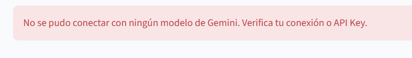

# 🚀 Guía Maestra: Datos al Ecosistema 2026 (MinTIC)

**Mentoría SENA - Estrategia para Ganar**

Esta guía contiene los estándares obligatorios y estratégicos para que sus proyectos no solo sean elegibles, sino que dominen el podio ante el jurado de MinTIC.

## 1. Reglas de Oro (No negociables)

* **Equipo:** 2 a 4 personas. **Mínimo una mujer por grupo.** (Criterio de inclusión).
* **Datos:** Uso obligatorio de al menos un dataset de [datos.gov.co](https://www.datos.gov.co).
* **IA:** El proyecto debe resolver algo usando Inteligencia Artificial (ML, NLP o Visión).
* **Metodología:** Documentación obligatoria bajo **CRISP-ML(Q)**.
* **Fechas:** Inscripciones del 10 al 30 de abril de 2026.

---

## 2. Rigor Técnico: El Fantasma del Overfitting 👻

Para ganar el 20% de **Rigor Técnico**, deben demostrar que su modelo funciona en el mundo real, no solo con sus datos de entrenamiento.

* **Validación Cruzada:** Dividan sus datos en entrenamiento y prueba (80/20). Usen *K-Fold Cross Validation*.
* **Regularización:** Si usan redes neuronales o modelos complejos, apliquen técnicas para evitar que el modelo se "memorice" los datos.
* **Métricas Reales:** No se queden solo con el *Accuracy*. Usen Precision, Recall y F1-Score para justificar la utilidad social.

---

## 3. Estrategia de Selección de Variables (Feature Selection)

El jurado premiará la capacidad de simplificar el problema. Justifiquen sus columnas usando:

1. **Varianza:** Eliminar ruido.
2. **Correlación:** Evitar redundancia.
3. **Importancia por IA:** Usar modelos base (como Random Forest) para ver qué variables tienen más peso en la solución.

---

## 4. Impacto Social e Innovación (40% del puntaje)

No es solo código. Es **solucionar un dolor del país**.

* **Enfoque:** Salud, Seguridad, Movilidad, Educación o Medio Ambiente.
* **Soporte:** Citen fuentes oficiales (OMS, DANE, DNP) para demostrar que el problema es crítico.
* **Escalabilidad:** Expliquen cómo su solución puede crecer de una ciudad (ej. Cartagena) a todo el país.

---

## 5. Acceso Pro vía API

Conéctense directamente a la nube de MinTIC para demostrar profesionalismo técnico:

* **App Token:** `e0umakk5lo0xz8m7cfh7lccic`
* **Header:** `X-App-Token`

---

## 6. Estructura de Evaluación del Jurado

| Criterio                 | Peso | ¿Cómo ganar?                                      |
| :----------------------- | :--- | :-------------------------------------------------- |
| **Innovación**    | 20%  | Resuelvan algo que nadie más esté mirando con IA. |
| **Uso de Datos**   | 20%  | Usen más de un dataset y límpienlos con rigor.    |
| **Rigor Técnico** | 20%  | Demuestren que evitaron el Overfitting.             |
| **Uso de IA**      | 20%  | Justifiquen la elección del modelo y su ética.    |

---

**¡A ganar!**
